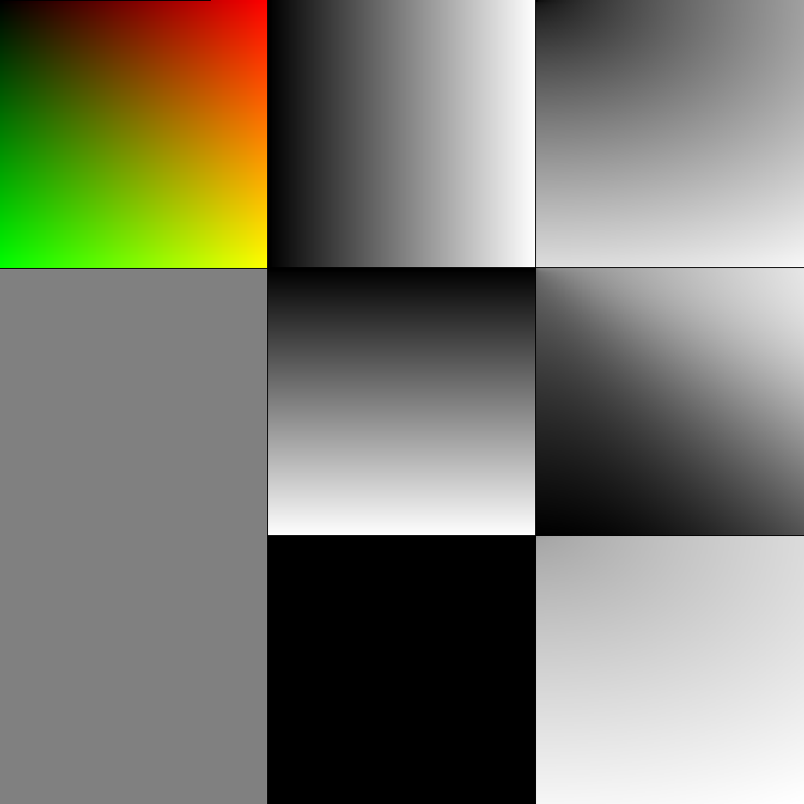
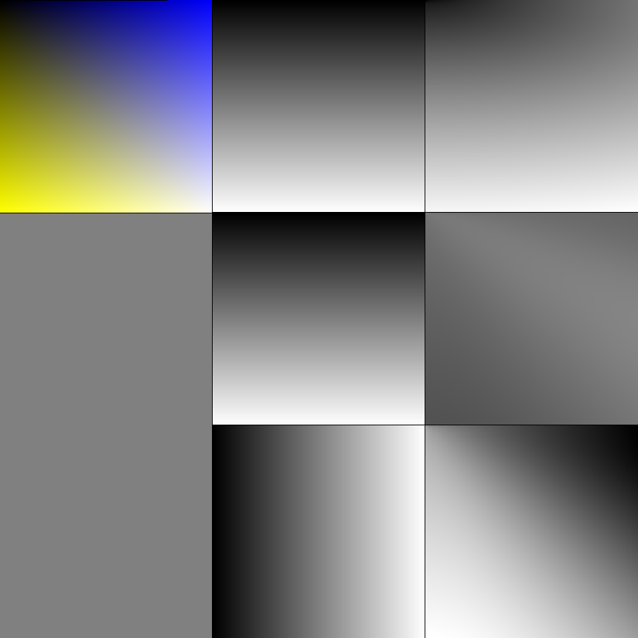
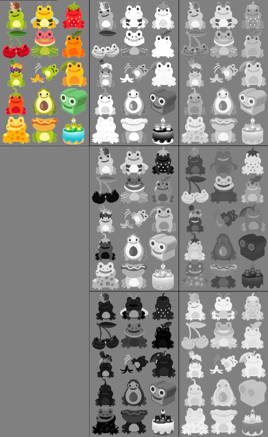

# Comparing Color Channels of RGB and Lab

This section uses varies colorful images to illustrate the color channels of RGB and Lab color model.

For each image, there are three columns (left to right): original image:, RGB channels and Lab channels.

For the RGB channels part, there are three rows (top to bottom): red (R), green (G), blue (B).

For the Lab channels part, there are three rows (top to bottom): luminosity (L), green-to-red (a), blue-to-yellow (b).

For each channels part, white color represents the highest value or intensity in that channel; black color represents the lowest value; gray-scale gradient represent the values in-between.

## Red-Green Gradient

**Generation Rule:**

- red = x / width
- green = y / height
- blue = 0

## Blue-Yellow Gradient

**Generation Rule:**

- red = y / height
- green = y / height
- blue = x / width

## Colorful Image

Selected from: [Emoji Kitchen](https://emojikitchen.dev/)
